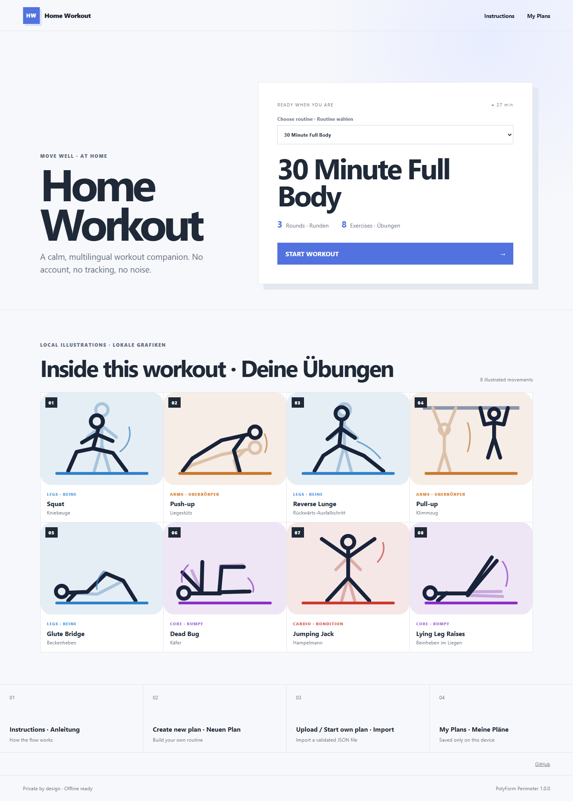

# Home Workout PWA

A calm, multilingual home-workout companion for phones, tablets, and desktop browsers. The app is static, account-free, tracking-free, and designed to keep working offline after the first load.

The local exercise illustrations show both body position and movement direction. The three most easily confused floor movements—Glute Bridge, Dead Bug, and Lying Leg Raises—are documented in [Exercise sources](docs/exercise-sources.md).

Source available under the PolyForm Perimeter License 1.0.0.

## Purpose

Home Workout makes a structured routine easy to follow without an account, backend, or fitness-influencer aesthetic. Workout plans are versioned data, translations are generic BCP-47 language records, and all private state stays in the browser.

## Features

- Timestamp-based workout, duration, and rest timers that tolerate browser backgrounding
- Pause/resume across every logical clock and reload-safe active sessions
- One- or two-language exercise presentation; German and English are bundled
- Six permanent bundled routines for general fitness, beginners, strength, cardio, active circuits, and advanced bodyweight training
- A routine picker plus an immutable-default model: bundled routines cannot be overwritten, while local plans are stored separately
- Visual plan editor with editable exercise targets, editable local plans, safe copies of bundled routines, duplicate/delete actions, custom exercises, local save, JSON import/export, and strict validation
- Validated AI-plan launch links plus a public machine-readable guide for ChatGPT and other assistants
- 33 extensible exercises with movement-specific original local SVG illustrations, shown directly on the home and workout screens
- Per-round `Exercise X / Y` progress and a visible easier-alternative chooser during workouts
- A clear, confirmed workout-abort action; the Home Workout brand uses the same safe return-to-home flow
- Stable workout controls and automatic timers without a manual repetition tap counter
- Responsive layouts, keyboard focus, 44 px controls, a calm light-only theme, and reduced-motion support
- Installable PWA with an offline app shell, library, images, and local plans

## Screenshots



## Installation and development

To install the published site as an app:

- Android Chrome: open the site, choose the browser menu, then **Add to home screen → Install**.
- iPhone/iPad Safari: choose **Share → Add to Home Screen**.
- Desktop Edge or Chrome: use the install icon in the address bar or **Apps → Install this site as an app** in the browser menu.

For local development, Node.js 22 and npm are required.

```bash
npm ci
npx playwright install
npm run dev
```

The app uses Vite, strict Vanilla TypeScript, semantic HTML, and CSS. There are no runtime framework dependencies or external runtime CDNs.

## Tests and coverage

Tests were authored in an independent test context before production code.

```bash
npm test
npm run coverage
npm run e2e
```

Vitest owns business logic and large input sets. Playwright uses a representative Chromium phone, Firefox desktop, and WebKit tablet matrix. On Windows it safely uses Chromium for all three device profiles by default because Windows Security may block Playwright's WebKit helper; set `PLAYWRIGHT_NATIVE_ENGINES=1` only in a prepared test environment. CI requires at least 95% for lines, statements, functions, and branches.

## Mutation testing

```bash
npm run mutation
```

StrykerJS mutates the engine, timer, validator, persistence, and plan transformations. The configured break threshold is 70%, with 90% classified as high.

The latest local result and survivor review are documented in [`docs/mutation-testing.md`](docs/mutation-testing.md).

## Build

```bash
npm run build
npm run preview
```

The output is a static PWA in `dist/`, ready for the existing Cloudflare Pages project.

## Cloudflare deployment

Production is hosted in the Cloudflare Pages project `home-workout` in the owner's Cloudflare account. The default Pages URL is `https://home-workout-65g.pages.dev`. Changing that generated hostname requires either a custom Cloudflare domain or a new globally available Pages project name; the pending owner choice is tracked in [`BACKLOG.md`](BACKLOG.md).

```bash
npm run build
npm run deploy:cloudflare
```

Wrangler uses the locally authenticated Cloudflare account. Do not commit OAuth credentials, `.wrangler/`, deployment output, or generated archives.

## Plan schema

Plans use strict `schemaVersion: 1`. The machine-readable schema is at [`public/schema/workout-plan-v1.schema.json`](public/schema/workout-plan-v1.schema.json). Runtime validation rejects unexpected properties, invalid language references, unsafe markup, impossible targets, and unsupported versions. Exported plans import without loss of supported fields.

## Languages

German (`de`) and English (`en`) ship with the app. Plans may use any supported BCP-47-style code and a free-form display label. After adding a language, the Plan Studio exposes editable plan names plus exercise names and instructions for that language. German is not a required base language. One or two configured languages can be displayed in caller-defined order.

## Exercise library

The library contains 33 stable records across legs, push, pull, core, cardio, and full body. Every record contains equipment, difficulty, type, target, movement-specific DE/EN copy, variant IDs, and a local SVG. The bundled routines use illustrations throughout; the balanced default includes Reverse Lunges and Lying Leg Raises (Beinheben im Liegen). Run `node scripts/generate-exercise-assets.mjs` to regenerate illustrations. Source assignment and independent text/pose sign-off are tracked per exercise in [`docs/exercise-audit.md`](docs/exercise-audit.md).

The implemented plan catalogue and architecture are documented in [`docs/project-documentation.md`](docs/project-documentation.md). All open work is durably tracked in [`BACKLOG.md`](BACKLOG.md), with fuller product context in [`docs/product-roadmap.md`](docs/product-roadmap.md).

## Dependency licensing

```bash
npm run check:licenses
```

Allowed production licenses are MIT, BSD-2-Clause, BSD-3-Clause, ISC, Apache-2.0, CC0-1.0, BlueOak-1.0.0, and Python-2.0. The app currently has no production package dependencies.

## License

This project is source available under the [PolyForm Perimeter License 1.0.0](LICENSE). It is not described as open source. Copyright © 2026 Dr. Dustin Hebecker; see [COPYRIGHT_NOTICE.md](COPYRIGHT_NOTICE.md).

## Contribution policy

Issues and feature requests are welcome. Until a CLA exists, external code contributions are not intended for integration. External code contributions must not be merged without an appropriate CLA or explicit copyright/relicensing grant. See [CONTRIBUTING.md](CONTRIBUTING.md).
